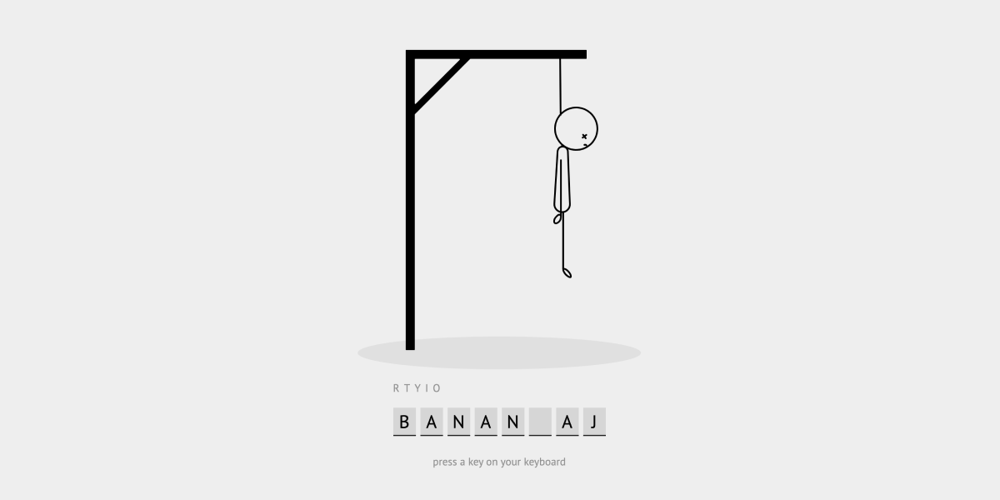
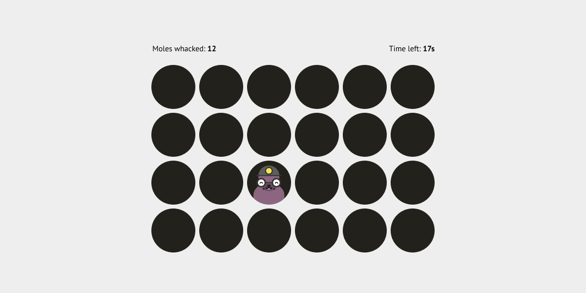

# Förslag på slutprojekt

## Memory med Svelte
Gör om ditt memomry till Svelte

## Bildspel


## Söka fram bilder via API
ex. Flickr eller unsplsah API.

## Hangman
Klassiska hänga gubbe med HTML, CSS och JS.

### Instruktioner
Du ska bygga det klassiska spelet **hangman** ( el. hänga gubbe på sve ). Använd ```hangman.svg```.



## Whack A Mole
Litet vanilla JS projekt där man ska koda det klassiska spelet Whack-A-Mole.




## Tärningsspel

### Stegen
Gör ett tärningspel där användaren ska kasta 1st tärning. Vid första kastet ska målet vara 1. Om 1 ej fås, ska man försöka igen. Hur många kast tar det för att komma upp i en stege, 1,2,3,4,5,6? Kast räknas och den med lägst antal kast vinner.

Visa med snyggt gränssnitt. 


### Knock out
- Spelet har 2st tärningar.
- Du som spelare väljer ett “knock out number” – antingen 6, 7, 8, eller 9.
- Spelaren kastar båda tärningarna. Anteckna varje kasts resultat.
- Om spelaren kastar något utav "knock out numbers" ges minuspoäng

Vinner gör man antingen på högst poäng på 1 minut, alt. högst poäng efter N knock outs.

Visa med vackert gränssnitt gjord med HTML och CSS.

### Going to Boston
Spelet har 3st tärningar.

1. Kasta tärningarna och spara tärningen med högsta värdet.

2. Kasta de kvarvarande 2 och spara tärningen med högsta värdet.

3. Kasta sista tärningen och summera samtliga tre tärningar.

Spelaren med högst summerat värde vinner. Max poäng är 18. 

Visa med vackert gränssnitt gjord med HTML och CSS.
